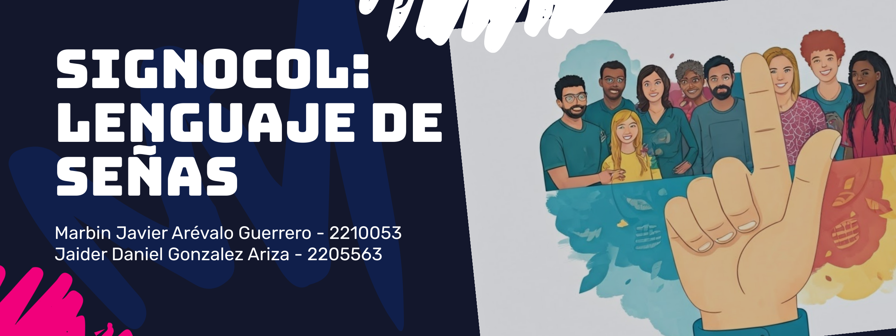

# **SignoCol**

## Autores: 
Javier Arevalo, Jaider Gonzales
## Objetivo: 
Inteligencia Artificial para el Reconocimiento del Lenguaje de Señas.
## Dataset: 
Se trabajó 1 dataset, correspondiente al abecedario en lenguaje de señas excluyendo la letra 'Q'.
- [Alfabeto ASL](https://huggingface.co/datasets/Marxulia/asl_sign_languages_alphabets_v03)
## Modelos: 
- Dense Neural Network
- Convlutional Neural Network
- CNN (EfficientNetB0)
- CNN (MobileNetV3 Small)
## Enlaces del video, presentación y notebook
- [Video]()
- [Presentación](https://www.canva.com/design/DAGTBJBoM14/cpO-8Rf2wwn-yTNmW1aXTA/edit?utm_content=DAGTBJBoM14&utm_campaign=designshare&utm_medium=link2&utm_source=sharebutton)
- [Notebook Anexo al Repositorio](IA2.ipynb)
